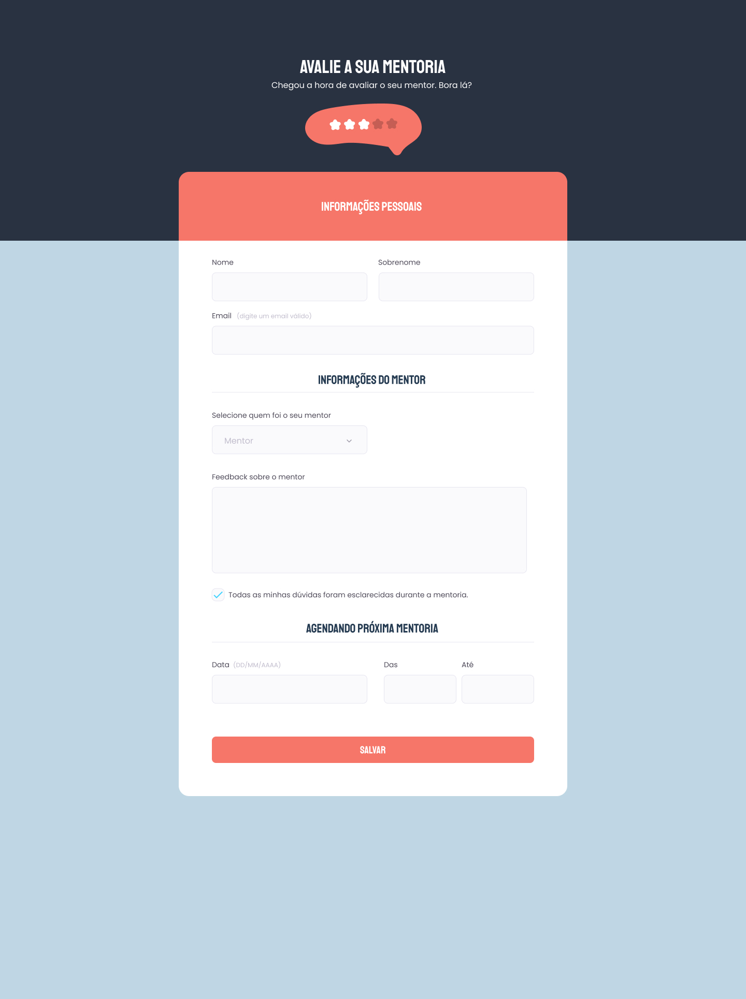

<h1 align="center">Formulário para avaliar sua mentoria</h1>

  

## 🚀 Tecnologias

Esse projeto foi desenvolvido com as seguintes tecnologias:

- HTML
- CSS

## 💻 Projeto

Um formulario feito com HTML e CSS com o intuito de estudar e rever os conceitos de formulários e estilizações do mesmo.

---

Feito com ♥ by Cleber-Risu
